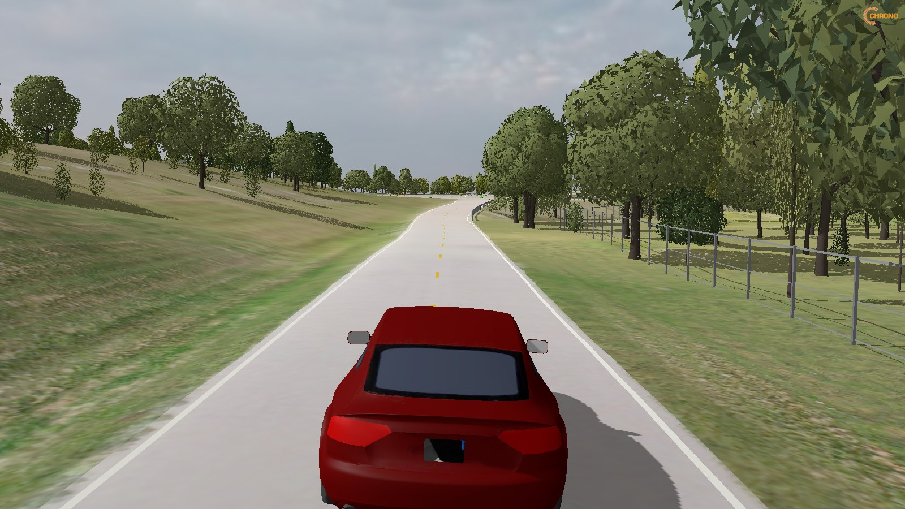
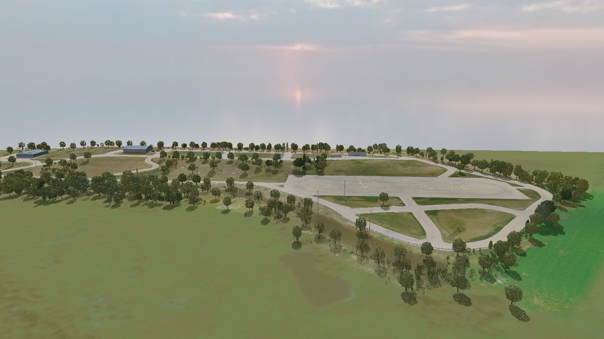
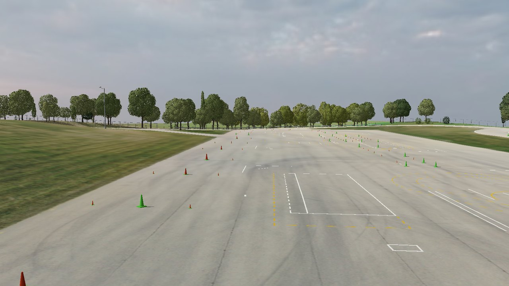
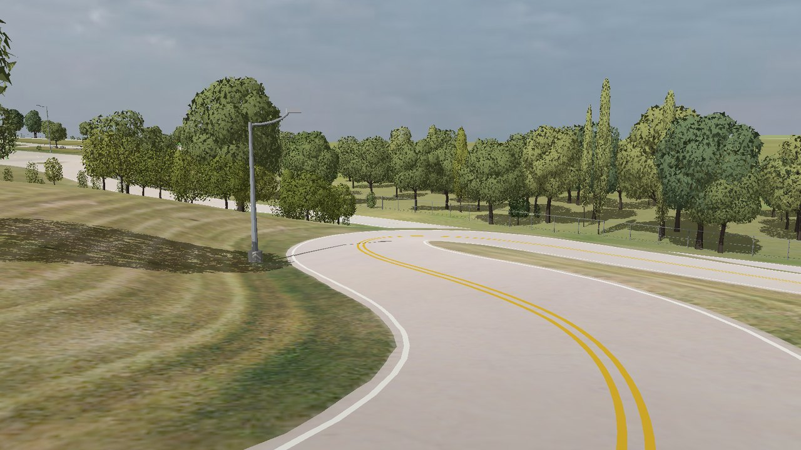
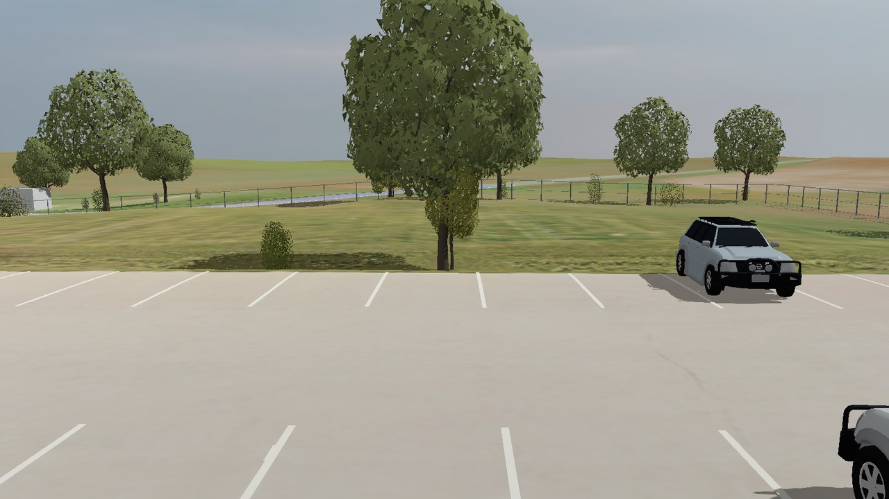
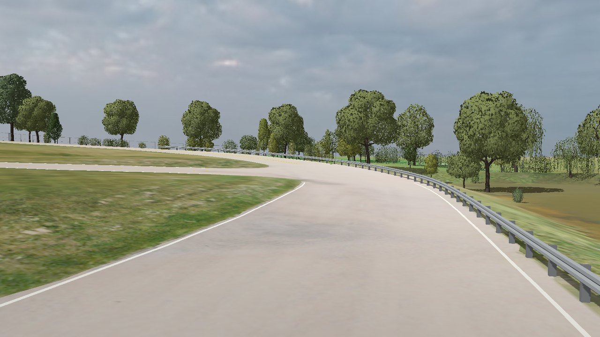
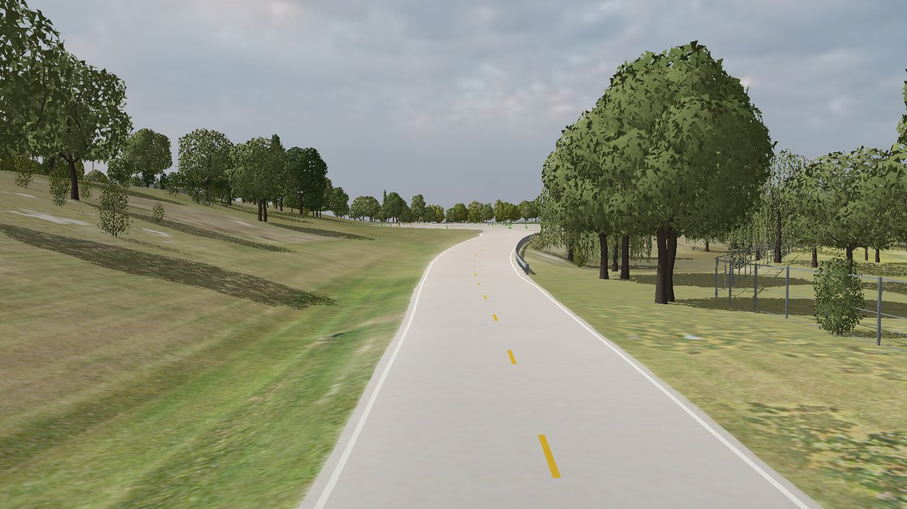
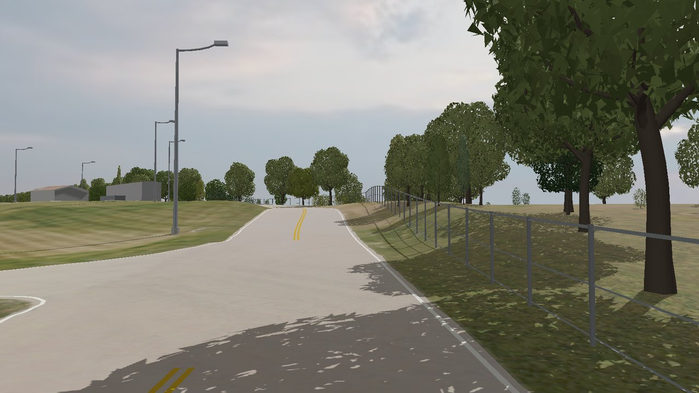
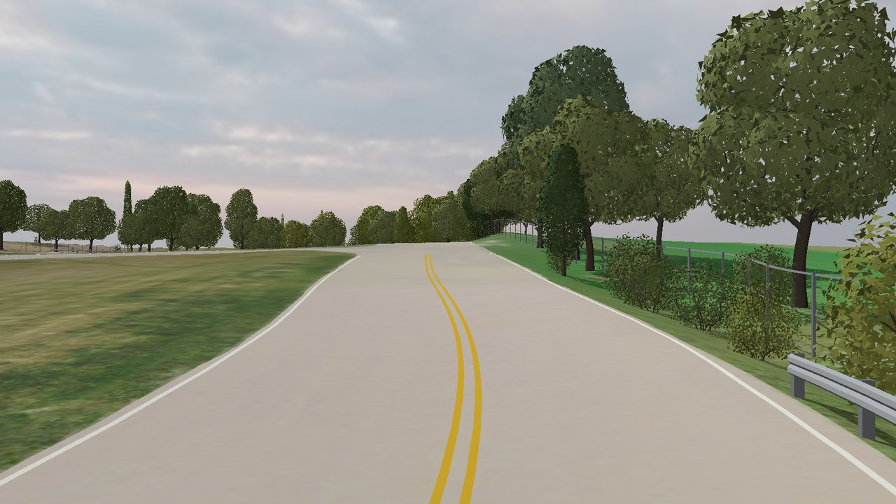

# chrono-columbus-speedway

Columbus 151 Speedway, a vehicle test track at W2140 Krause Road, Columbus, Wisconsin, as a
drivable [PyChrono](https://projectchrono.org) scene in one Python script. It runs on stock
PyChrono. Nothing is converted and Chrono is not modified.



| | |
| --- | --- |
|  |  |
| The site from the south-east | The skid pad, with its cones and painted courses |
|  |  |
| The S-bend west of the pad | A car park by the main building |
|  |  |
| The curve by the pond | The south-east straight |
|  |  |
| The north road at a junction | The east road |

All of these are stock Chrono::VSG, drawn by `tools/look.py` from the scene the script downloads.

## Run it

```sh
conda install projectchrono::pychrono -c conda-forge
curl -LO https://raw.githubusercontent.com/ksha23/chrono-columbus-speedway/main/speedway.py
python speedway.py
```

The first run downloads the scene (94 MB) into `scene/` beside the script, checks its
SHA-256 and unpacks it. Later runs start in a few seconds.

Hold **W** to accelerate and **S** to brake, and hold **A** or **D** to steer. Let go and the car
coasts and the wheel centres, as in a driving game.

| Option | |
| --- | --- |
| `--no-trees`, `--no-cones`, `--no-poles`, `--no-vehicles`, `--no-barriers`, `--no-props` | leave out the trees, the traffic cones, the light poles, the parked vehicles, the guard rails and fence, or the small structures |
| `--no-markings` | leave out the road paint: bare concrete, for laying out lanes of your own |
| `--no-edge-lines` | leave out the white lines along the road edges. They are an addition: the real track has none |
| `--textures low\|standard` | ground photo at 10 cm or 5 cm per pixel, default `standard` |
| `--offroad-friction MU` | friction off the pavement, which has 0.9. Default: 0.9 everywhere. See below for what it costs |
| `--no-shadows` | do not draw shadows. Worth trying on a slow GPU |
| `--no-sky` | plain background instead of the sky dome |
| `--keys held\|step` | `held`, the default, follows the keys held down. `step` is Chrono's older behaviour: each press nudges an input and it stays there |
| `--data DIR` | keep the scene somewhere else |
| `--tire pac02\|tmeasy\|rigid` | tire model, default `pac02` |
| `--tire-step S` | tire internal step in seconds, default `1e-4` |
| `--speed-limit V` | with `--keys step`, the speed the throttle steps are scaled toward, default 20 m/s |
| `--duration S` | stop after S simulated seconds |
| `--snapshot FILE` | save a picture of the window two seconds in |
| `--headless` | no window. Sets the car down with the brakes on and checks that it rests on the ground |

PyChrono has to come from the `projectchrono` conda channel. The `conda-forge` package of the
same name has no vehicle or VSG module.

The simulation holds real time. When a frame takes too long to draw, the script skips frames
instead of slowing the car down.

## Use the track in your own simulation

`speedway.py` is also a module. Put it next to your script:

```python
import pychrono as chrono
import pychrono.vehicle as veh
import speedway

system = chrono.ChSystemNSC()
system.SetCollisionSystemType(chrono.ChCollisionSystem.Type_BULLET)

scene = speedway.fetch()                      # scene directory, downloaded if it is not there
speedway.add_scenery(system, scene)           # what you see: visual shapes, no collision
terrain = speedway.add_ground(system, scene)  # what the wheels touch: one collision mesh

x, y, yaw = speedway.start_pose(scene)        # a pose on the long straight
z = speedway.ground_height(scene, x, y)       # ground height there
```

- `add_scenery` puts every placement on a few fixed bodies as visual shapes. Pass
  `groups=["Road", "Terrain"]` to load only some of `Road`, `Terrain`, `Buildings`, `Trees`,
  `Cones`, `Poles`, `Vehicles`, `Barriers`, `Props`, `Markings` and `EdgeLines`. Each kind of
  object is its own group so it can be left out and replaced with a layout of your own.
- `add_ground` returns an initialized `RigidTerrain` over one mesh: pavement, grass, banks and
  the fields around. They are the same triangles the scenery draws, so what you see is what you
  drive on. Pass `offroad_friction=0.6` to get the pavement and the rest as two patches with
  their own friction. The surface is the same, since the two meshes share their boundary, but a
  step of the demo then takes 0.45 ms instead of 0.31 ms: Chrono casts one ray per patch for
  every tire query.
- The site keeps its real elevation. The track is near **z = 295 m**, not z = 0. Use
  `ground_height` to place things: `RigidTerrain.GetHeight` returns 0 until the first
  `DoStepDynamics`.
- Everything but the ground is drawn and nothing else: trees, buildings, cones, poles, rails
  and parked cars have no collision shapes.
- `speedway.manifest(scene)` is everything else the scene records, as a dict. See below.
- For Chrono::Sensor, every material carries a class id. `speedway.labels(scene)` says what
  each id means.

The scene is plain files, so C++ Chrono or any other tool can read it too. `speedway_ground.obj`
works directly with `RigidTerrain::AddPatch`, and so do `speedway_road.obj` and
`speedway_terrain.obj` as a pair.

## What is in the scene

```
speedway_scene.json    manifest: 140 assets, 1,181 placements in 11 groups
speedway_ground.obj    the ground as one welded collision mesh, 643,934 triangles
speedway_road.obj      the pavement's 78,888 of those triangles
speedway_terrain.obj   the other 565,046
ground/                the same triangles split by texture tile, with texture coordinates
textures/standard/     ground photo at 5 cm per pixel, one JPEG per tile
textures/low/          the same at 10 cm
textures/surround.jpg  aerial imagery for the land beyond the scan
trees/                 54 generated tree models, wood and leaves apart
buildings/             4 buildings, walls and textured roof apart
cones/                 one traffic cone, body and base apart
poles/                 light poles, one model per height
vehicles/              parked cars: 3 models made from the vehicle meshes Chrono ships
barriers/              guard rails and the fence round the property, each built in place
props/                 one block, placed and sized for each small structure
markings/              road paint as two meshes, yellow and white, and strokes.json.
                       The edge lines as a third, and edge_lines.json
```

Lengths are metres. x is east, y is north and z is up, which is Chrono's own frame. The origin
is at UTM zone 16N easting 329450, northing 4794560 (latitude 43.28455, longitude -89.10212),
and z is elevation above sea level. The scene is 1280 m by 1024 m. The drone scan covers
17.8 hectares in the middle of it, and the fields and woods around come from aerial imagery so
the view has a horizon.

The manifest looks like this:

```json
{
  "version": 4,
  "frame": { "utm_zone": 16, "origin_easting": 329450.0, "origin_northing": 4794560.0,
             "extent": [-640.0, -512.0, 640.0, 512.0] },
  "labels": ["Road", "Terrain", "Buildings", "Trees", "Cones", "Poles", "Vehicles", "Barriers",
             "Props", "Markings", "EdgeLines"],
  "collision": { "ground": "speedway_ground.obj", "road": "speedway_road.obj",
                 "terrain": "speedway_terrain.obj" },
  "start": { "x": -49.95, "y": -79.23, "yaw": 0.72 },
  "assets": [
    { "name": "broadleaf_0_1_light",
      "parts": [
        { "name": "wood", "mesh": "trees/broadleaf_0_1_light_wood.obj", "colour": [0.3, 0.25, 0.2] },
        { "name": "leaves", "mesh": "trees/broadleaf_0_1_light_leaves.obj",
          "colour": [0.2, 0.33, 0.1], "double_sided": true } ] } ],
  "instances": [
    { "asset": 61, "group": "Trees", "name": "tree_0003", "kind": "broadleaf",
      "pos": [245.12, 212.12, 292.32], "rot": [0.80238, 0.0, 0.0, 0.59681],
      "scale": [0.97, 0.97, 0.966], "height": 12.6, "crown_radius": 5.2,
      "colours": { "leaves": [0.397, 0.418, 0.086], "wood": [0.127, 0.098, 0.073] } },
    { "asset": 112, "group": "Cones", "name": "cone_020", "height": 0.71,
      "pos": [180.29, 149.7, 294.472], "rot": [1.0, 0.0, 0.0, 0.0],
      "scale": [0.71, 0.71, 0.71],
      "colours": { "body": [0.144, 0.989, 0.073], "base": [0.144, 0.989, 0.073] } } ]
}
```

- An asset is a list of single-material meshes. A part has a `colour` and may have a `texture`.
  A ground texture path contains `<level>`, to be replaced by `standard` or `low`.
- An instance places asset number `asset` at `pos` with `rot` as a (w, x, y, z) quaternion and a
  per-axis `scale`. `colours`, if present, overrides the colour of the named parts for that
  placement. A tree records the `height` and `crown_radius` measured for it, a cone its `height`.
- Colours and textures are stored the way the renderer needs them, not as they look. See
  [the renderer](#the-renderer) below.
- Paths are relative to the manifest.

To fetch the scene without the script:

```sh
curl -LO https://github.com/ksha23/chrono-columbus-speedway/releases/download/v4/speedway_scene_base.tar.gz
echo "aec0c430eff2424e7f6b2a8e30405a45b1f933ef70ef505b01f40a6ca407c5fa  speedway_scene_base.tar.gz" | shasum -a 256 -c
mkdir scene && tar -xzf speedway_scene_base.tar.gz -C scene
```

## How the scene was built

The source is a drone photogrammetry scan of the site: a single textured mesh of 456,280
triangles with 1.3 GB of photo texture at about 2 cm per pixel. A scan like that is a good
picture and a poor model. Its trees are blobs, its cones are flattened into the pavement, the
shadows of the day are printed on the ground, and this one was the wrong shape. So the scan
supplies the picture and the positions of things, and the shape of the ground comes from
somewhere better.

**The ground is the USGS lidar survey.** The scan was georeferenced from the drone's own GPS
with no ground control. Compared with the USGS 3DEP lidar elevation model it is 3.4% too large
and domed: its ground curves away from the truth by more than 14 m between the middle of the
site and the ends. The ground mesh is therefore built from the lidar, on a 1 m grid where the
scan has coverage and 8 m beyond. On the skid pad the lidar surface is flat to 4 mm.

**The scan is fitted onto it.** Horizontally with an affine map, in effect a scale of 0.967, a
small rotation and a shift, found by sliding 80 m windows of the scan's ground over the lidar
surface until ditches and banks line up. Vertically with a polynomial that removes the dome. After the fit the scan's open ground is
within 4 cm of the lidar at the median and within 26 cm for 95% of points, measured on blocks
of ground held out of the fit. Horizontal position was checked against a second source the fit
never saw, USGS aerial imagery: the two agree within 1.1 m at the median and 2.1 m at worst.
That figure is the limit of the check as much as of the fit, since the imagery was read at
0.5 m per pixel.

**The photo is redrawn from above** in the corrected frame at 5 cm per pixel, and then cleaned:

- *Shadows.* The photographed shadows are relit and then levelled to the tone of the sunlit
  ground around them, so the renderer's own shadows are the only ones. On pavement that tone
  is taken from well inside the road, clear of its edges, and the dapple under a tree is
  replaced outright with plain concrete. The mosaic was flown at two times of day, around
  midday and mid-afternoon by the shadow directions, and each half is treated with its own
  sun. The thin shadows of light poles, posts and fences are not in the scan's heights at all,
  so they are found in the picture as straight dark lines and painted out separately.
- *Whatever stood on the ground.* A thing photographed from above is a flat picture of its
  top with a shadow beside it. Each kind is found, painted out of the photo together with its
  shadow, and put back as an object: see the next section.
- *Trees and buildings.* Whatever stands more than 1.5 m above the lidar ground is a tree or a
  building, and so is anything from 0.7 m up that stands alone in grass and is the colour of
  a plant: the site has rows of planted spruces a metre high. The picture of its top is
  painted over with the ground around it, and so are the holes the scan left where a canopy
  was too dense to reconstruct.

- *What is left on the roads.* After all of that, a road that ran under trees still has
  flecks of sun and scraps of crown on it, and one has the shadow of a lattice tower across
  it, all thin lines that no shadow step saw. Pavement is one material. So on the roads, and
  on any pavement within 4 m of where a shadow was relit or a crown stood, whatever stands 12
  grey levels off the pavement around it and is small (under 2 m2) or thin (no wider than
  1.2 m anywhere) is painted over with plain pavement: 6,228 blotches, 1,282 m2 in
  all. A patch of different pavement is neither small nor thin, and stays.

Every patch that is painted over gets its colour from the ground around it and its grain from
the cleanest 19 m square of the same surface on the site. Even that square of concrete has a
joint, a crack, a tyre mark and a painted corner in it, and each would be stamped onto every
patch, so anything in the square that stands out from its own grain is taken out first.

**Everything that stood on the ground is an object.** What the scan gives for each is where
it stands and how big it is. The rest is a model.

| | Found by | Put back as |
| --- | --- | --- |
| 132 traffic cones | colour on the pavement: orange, lime green or brick red. Height from the length of the shadow | Chrono's traffic cone, scaled and coloured |
| 21 light poles | the shadow: a straight dark line a few metres long, a hand wide, pointing away from the sun, with the pole's own flattened picture at its foot. Height from the shadow's length and the sun's elevation | a generated pole: footing, tapered shaft, arm and lamp, the arm out over the nearest pavement |
| 7 parked vehicles | car-sized things 1.4 to 2.5 m tall on pavement. Colour from the photo, and the front is the lower end | a sedan, a hatchback or an SUV made from the vehicle meshes Chrono ships, in that colour, tilted to stand on its four wheels where the ground slopes |
| 609 m of guard rail in 6 pieces | thin lines of galvanised steel, bluer than what they lie on, where the scan shows something under a metre tall | a W-beam on posts, facing the road |
| the fence, 1,581 m | the same, away from pavement. It shows for 616 m and is carried on between those stretches, since it runs round the whole property. One gate, at the entrance | posts, a top rail and two wires |
| 5 small structures | colourless, even-topped things up to 3.5 m tall: tanks, a hut, bleachers | a block of the footprint, height and colour measured |
| 768 strokes of road paint | traced in the photo, then refitted as straights and arcs: see below | ribbons laid 2 cm above the road |

**Road paint is drawn, not photographed.** In the ground's picture a lane line is two texels
wide, and from a car, at a shallow angle, the renderer's texture filtering smears it away.
So the paint is traced in the photo, taken out of it, and drawn as its own geometry, which
stays sharp at any distance.

What is drawn is not the trace. A trace is true to the photo: a line worn through in the
middle comes back as two, a rectangle's sides stop short of its corners, a curve carries the
wobble of its pixels. Paint is laid by machine along a string or round a pin, so each stroke
is refitted as what it must have been: straight segments and circular arcs meeting at sharp
corners. Pieces of one line are joined across worn gaps, ends are carried on to the line they
stop short of, and the dashes of a run are laid on one smooth curve at one length. A solid
line that runs under a tree comes out of the trace in two pieces: they are joined if they
point at each other and the photo does not show bare road between them (3 joins).
Short strokes alone in a tree's dapple are flecks of sun, and are dropped (16). Where a lane
line's run has a gap of exactly two or three spacings, under a tree's shadow for instance, the
missing dashes are put back: 4 of them.

A double yellow line needs more than that. Its two lines are a hand apart, and at 5 cm a
pixel the photo shows the pair as one band of yellow where a single line shows a narrower
one. The trace follows one line somewhere in that band, or both for a while, so a double line
drawn from its trace is single for most of its length, with a second line that starts and
stops beside it and is not quite parallel. So for these the trace only says where to look.
Every half metre along it the photo is asked where the middle of the yellow is and how wide
it is. The width settles what the line is: along every pair on the site four readings in five
fall between 0.35 and 0.45 m, and along every single line between 0.17 and 0.29. The middles give one smooth curve, and
the pair is drawn at equal distances either side of it, parallel because the two lines are
the same curve. Worn paint drops out of the trace long before it drops out of the photo, so
each double line is also followed past both ends of its trace, half a metre at a time, for
as long as the photo shows yellow where the road's own curve says the line should be.
426 m of double line is drawn this way, in 4 lines, 48 m of it
beyond where the trace stopped. The whole width of the band is painted out of the photo.

White paint on a road is a different problem: there is none. On the skid pad and in the car
parks white paint is everywhere, in every shape. On a road it could only be a line, long and
crisp, and what the trace finds there is the joint down the middle of a slab, the pale rim of
a stain, sand washed onto the pavement's edge, a dead branch, and light poles, which lean in
a photo taken from above and lie across the pavement as thin white lines. So away from the
pad and the car parks a white stroke is kept only if it is one of a run of dashes, or is two
metres long and passes a second, harder look at the photo. 37 strokes were dropped that
way. 4 more were poles, and are painted out with the rest of the pole.

Parking stalls get the same treatment as a row. Their lines are the faintest paint on the
site, white on concrete the sun has bleached nearly as white, and tracing finds only some of
each row and often only part of a line. A row of stalls is parallel lines one pitch apart, all
of one length, so each row is fitted as that. A row takes in every traced line that lies on
its lattice, however long the gap, since the stalls along one kerb are one row. Every line
between its first traced line and its last is then drawn, because a row has no line missing
from its middle, and past its ends the row is followed for as long as the photo shows paint
along the lines it predicts. 4 rows were found, at a pitch of 2.7 m, and
43 lines are drawn where 20 had been traced. The strokes travel with the scene as
`markings/strokes.json`: 1,619 m of yellow and 827 m of white in 768 strokes, in
scene coordinates, for anyone who wants the lane geometry as data.

**Edge lines are an addition.** The real track has no painted edge lines. The scene has them
as an option, on by default: a white line 10 cm wide along both edges of every road, 3,499 m
in all, 30 cm in from the pavement's edge, following the kerb round each junction and running
inside the guard rail where there is one, at one distance from the rail for the rail's whole
length: a rail is the smoothest thing on the roadside, and a line that wanders beside it
shows. A line does not follow a jog in the outline: it is
carried across on a smooth curve if that keeps it on the pavement, and broken there if not.
It runs on across the mouth of a track or a footpath narrower than 4.5 m, does not double
back round the nose of an island between two roads, and stops 5 m short of a building. The skid pad and the car parks have none. They are
their own group, `EdgeLines`, with `--no-edge-lines` to leave them out, and their centre lines
are in `markings/edge_lines.json`.

**Road and land are separate meshes.** The pavement's outline is taken from the photo and the
ground mesh is cut along it, so every triangle is either road or not.

**A road is a strip of one width about its centre line.** Traced from the photo, a road's edge
is good to a few centimetres in the open and wrong by up to a metre wherever a tree's shadow
or crown lay over the kerb: the trace takes a bite out of the road or bulges into the grass.
The centre line is known, though: it is the yellow line, already fitted to a smooth curve. So
along each of the 13 centre lines the distance to the traced edge is measured on both
sides, metre by metre, the road's half width on each side is taken to be the running median
of those measurements over 30 m, and the outline is redrawn at that width: 2,865 m of
edge in all. Junctions keep their traced outline, since there the edge really does curve away.
Where the outline moves, the photo is repainted to match.

An edge that was only ever seen in shade is not trusted for that. Along the north road a
gravel shoulder lies in the shadow of a tree line for a hundred metres, and relit it passes
for concrete. Where fewer than two in five of the stations within reach saw their edge in
plain light, the road is taken to be as wide on that side as on the other: 748 m of
edge were drawn that way.

An edge drawn this way is smooth by construction, and nothing later is allowed to bend it.
At each end of a modelled stretch the width eases over 6 m into the outline as traced, so the
edge has no step where the one hands over to the other.

Three more rules tidy what that leaves, for the stretches with no centre line.

- A guard rail stands on the road's edge, so pavement that was only guessed at under a hedge
  is not carried on beyond one.
- A kerb runs on. Where the outline steps aside and comes back within a few metres, round a
  bush or the mouth of a footpath, the notch is cut out and its two ends are joined by a
  smooth curve. 48 kinks were taken out this way.
- Under a crown the edge is a guess, but it is in view before the crown and again after it,
  if only in glimpses between one bush and the next. A gentle curve is fitted through what
  was seen of the edge either side, passing by any bush that takes a notch out of it, and the
  unseen stretch is redrawn along that curve: 4 stretches.

None of the three argues with ground the photo shows plainly. A wedge of mown grass between
two roads is a notch in the pavement in every way but that one, and it stays.

**Trees are generated.** 535 crowns are measured in the scan. A crown too wide to be one tree
is replanted as several, which gives 949 trees. Each is a generated model chosen by its shape
(broadleaf, upright, willow, shrub), stretched to the measured height and crown width, and
coloured with the leaf colour the drone saw. No tree reaches over the pavement: one whose crown
would is stepped back from the road by up to 4 m, and whatever still crosses the edge is taken
off its width. Real crowns do hang over these roads, but a generated tree does not know to
grow up and over a lane, and its branches would hang in it at windscreen height. The 422 trees whose crowns come within 12 m of pavement get the full model,
up to 7,000 triangles. The other 527 get one with 40% of the triangles, because stock
Chrono::VSG draws every triangle of every tree again for each shadow map. An earlier build
with every tree at full detail ran at 16 frames a second on an M4 Pro. This one holds 47 to 50.

**Buildings are refitted** as a rectangle with straight walls and a gable roof, from the scan's
roof heights. The roof keeps its own photograph. The walls get one flat colour.

### The renderer

Stock Chrono::VSG takes a texture's values as linear light and encodes the result for the
display, so a photograph used as a texture comes out pale and flat. Measured with grey test
cards on PyChrono build 1187: flat ground in the script's light shows 0.70 of its texture value
in linear terms, and a cast shadow is 0.24 as bright as the sunlit ground beside it. Every
texture and colour in the scene is stored with the inverse of that applied.

That 0.70 is also a ceiling, and the light cannot be turned up past it: nothing lying on the
ground can show brighter than sRGB 218. The drone flew at midday and exposed the concrete at
200 to 235, with the paint on it at 240 and more. Stored as they are, white paint and concrete
both hit the ceiling and the line disappears. So the ground is shown a little darker than the
photo, at 0.8 of its brightness in linear light, and its highlights are rolled off so that no
part of it passes sRGB 187. Painted lines are drawn at the ceiling, which leaves white paint
about one and a half times as bright as the concrete under it. The cost is that the bleached
look of the concrete at midday is gone: it reads as ordinary grey. `tools/renderer.py` has
the numbers.

It also draws one side of a triangle only. Leaves are single triangles meant to be seen from
both sides, and `add_scenery` sets `SetDoubleFaced(True)` on them.

### Rebuilding it

`tools/` holds the whole pipeline, and `tools/build_all.sh` runs it from the scan to the
archive in 26 minutes on an M4 Pro. It needs numpy, scipy, Pillow and PyChrono, and about
15 GB of memory. Every step is seeded: a second run from scratch gave the same archive, byte
for byte. The script ends by checking the scene (`check_scene.py`: no tree on or over the
road, cones, cars and paint on it, every parked car standing on its four wheels, poles and
fence off it, no hole in the ground) and listing
what is still dark on the pavement (`audit_ground.py`). `audit_lines.py` draws every painted
line on the finished ground from above and circles each kink left in an edge line.
`tools/fetch_reference.sh` downloads the USGS data. The scan itself is not in this repository.

## What is not right

- **Buildings are boxes.** No doors, windows or wall detail, and the wall colour is a guess
  from the little the drone saw of them. The tanks, the hut and the bleachers are plainer
  still: one block each.
- **Road paint is found by a program, and it misses some.** Most of the small ruler ticks on
  the skid pad and the odd dash. In the car parks the hatching and the accessible-bay symbols
  are drawn as traced, a few lines each with ragged ends. Stall lines are drawn at their
  row's full length, so a line that really is shorter than its neighbours is not, and a row
  is assumed to have a line at every place between its first and its last.
- **Thin lines seen from far off break into dashes.** Stock Chrono::VSG draws without
  antialiasing. A stall line is 10 cm wide, and seen crosswise from 30 m away it is thinner
  than a pixel, so it shows as a row of dashes that crawl as the car moves. Up close it is
  solid. Lines that run away from the viewer, as lane lines do, are not affected. Every
  yellow line is drawn 10 cm wide, where the real ones measure 11 to 17 cm. The edge lines follow the
  pavement's outline as the photo shows it, smoothed, so they are only as true as that
  outline: good on open road, less so where a hedge or a shadow hid the edge.
- **Objects are stand-ins.** The scan says where a thing stood and how big it was, not what
  it was. A parked crossover is drawn with Chrono's SUV scaled down, a car with its sedan or
  hatchback. Every light pole is the same design at a different height. Heights come from
  shadow lengths and are good to about half a metre.
- **Some light poles are missing.** A pole is found only where its shadow falls on open ground
  beside pavement and its own picture shows at its foot. 21 were found. Ones standing in a
  hedge or behind a guard rail were not, and their shadows are still in the photo.
- **The fence is three fifths guesswork.** It shows in the scan for 616 m of its 1,581 m. The
  rest runs under trees and is drawn straight between the stretches that show. The chain link
  itself is not drawn, only posts, top rail and wires, because a see-through panel throws a
  solid shadow in this renderer.
- **Trees are stylised.** Up close a leaf is a plain triangle about half a metre long. Species
  are guessed from crown shape. A tree beside a road is narrower than the real one, because its
  crown is made to stop at the pavement's edge. In the woods south of the track the scan could not separate
  crowns, so those trees are spread evenly over the canopy it saw, and thinner than the real
  woods. Trees away from the road are visibly sparser if you drive up to them.
- **Road edges are modelled where there is a centre line, traced where there is not.** Short
  connecting roads with no yellow line, junction corners and the aprons keep the outline the
  photo gave with its notches taken out, which still wanders by a few tenths of a metre. The
  model assumes a road keeps its width over 30 m, and that it is as wide on one side of its
  centre line as on the other wherever one side was in shade. 13 small kinks are
  left in the edge lines, the sharpest 25 degrees, at a corner where two roads meet.
- **Some trees are only a picture.** Where the scan could not build a crown it printed the
  crown flat on the ground under it. There is no height to find, so no tree is planted and
  the picture stays, as a dark green patch on the verge. Where such a crown lay over a road
  the road is redrawn under it, as above.
- **A lattice tower is still a picture.** It stands in the grass west of the road to the
  main building and throws a shadow more than 40 m long. The scan flattened it and nothing
  stands in for it yet. Its shadow is painted off the road and is still on the grass.
- **Small things are still in the picture.** A pile of rubble, a heap of junk by the entrance
  and the debris on the gravel lot beside it lie flat in the photo. Nothing stands in for
  them.
- **Shadow removal leaves traces.** Where a tree's shadow crossed the road the pavement is
  plain concrete of the right tone with borrowed grain, so cracks, joints and stains are
  missing there and for 4 m around, and the patch is cleaner than the road beside it. On
  every road, cracks, joints and narrow stains were painted out with the blotches, so the
  roads are plainer than the real ones. The skid pad and the car parks keep theirs. Thin shadows are painted out wherever a straight dark line three
  metres long was found, which takes a few sealed cracks with it.
- **Nothing has collision but the ground.** A car drives through trees, cones, rails, parked
  cars and buildings.
- **The road is as smooth as the lidar.** Joints, cracks and patches are in the picture and not
  in the surface. The lidar has 1 m posts.
- **The surround is a different photograph.** Beyond the scan the ground is USGS aerial imagery
  from another season and far coarser, colour matched. The seam shows from above.
- **The pond is a picture of a pond** on solid ground.

## Tested with

PyChrono 10.0.0 from the `projectchrono` channel, conda build `py313_1187`, on macOS (Apple
silicon). On an M4 Pro the demo holds real time at FPS frames a second with shadows on (50 is
the script's cap). It uses 4.8 GB of memory, or 3.5 GB with `--textures low`. Linux
and Windows have not been tried.

## Licence and credit

`speedway.py` and `tools/` are under the BSD 3-Clause licence in [`LICENSE`](LICENSE), the same
terms as Chrono.

The scene is built from:

- A drone scan of the site made in September 2024 by Wisconsin Autonomous, a student
  organization at the University of Wisconsin-Madison, and processed with
  [WebODM](https://www.opendronemap.org/webodm/).
- The [USGS 3D Elevation Program](https://www.usgs.gov/3d-elevation-program) lidar elevation
  model and [NAIP](https://naip-usdaonline.hub.arcgis.com/) aerial imagery, both public domain.
- The traffic cone and the vehicle meshes (sedan, Audi, Nissan Patrol) from
  [Project Chrono](https://projectchrono.org)'s data directory, BSD 3-Clause. The parked cars
  are those meshes regrouped by material, reduced, and given simpler wheels.

This repository is not affiliated with Columbus 151 Speedway or its owners.
